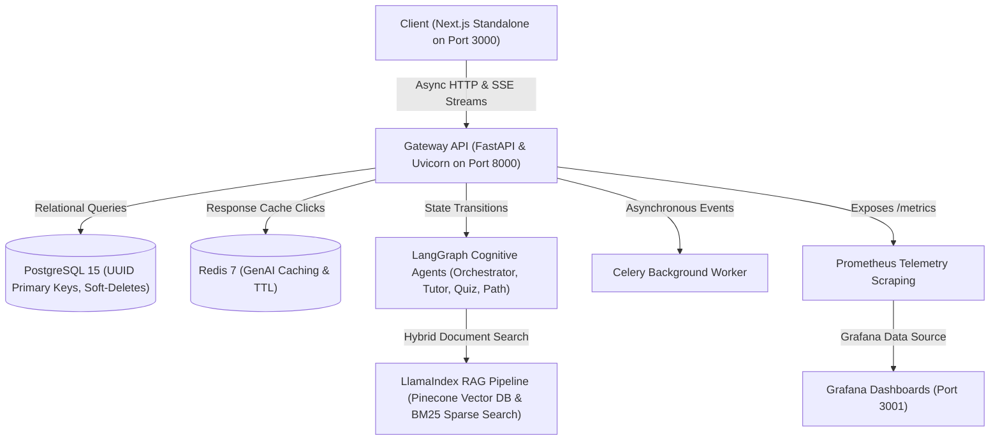

# AI Learning Management System (AI-LMS)
[](https://github.com/divyansh-Agarwal-16/AI-Learning-Management-System-LMS-/actions)
[](https://github.com/divyansh-Agarwal-16/AI-Learning-Management-System-LMS-)
[](LICENSE)

A production-grade, AI-powered Learning Management System featuring cognitive multi-agent tutoring, hybrid RAG document stores, Prometheus/Grafana instrumentation, and adaptive study path generation.

---

## 🚀 Live Demo

*Placeholder for Demo GIF - showing interactive React Flow Concept Maps, streaming tutor chat panel, and auto-generated quizzes.*

---

## 📌 Problem Statement

Conventional LMS platforms act as static file hosts, leading to several core engineering and pedagogical challenges:
* **Cold-Start Cognitive Overwhelm:** Students are presented with an exhaustive syllabus but no personalized pathways, forcing them to self-diagnose learning gaps and coordinate their own study timelines.
* **Context-Agnostic LLM Assistance:** Standard chatbot integrations lack direct semantic alignment with specific course slides, YouTube transcripts, or textbook chapters, leading to hallucinations and inaccurate guidance.
* **Asynchronous Process Coordination:** Single-prompt LLMs cannot enforce structured state workflows—such as pausing to test a student before continuing concepts—without experiencing conversation loop traps or context window drift.

---

## 🏗️ Architecture

The platform is designed around a distributed, containerized microservices topology. The client queries the backend through an async Gateway, which forwards execution threads to appropriate database wrappers, caching brokers, and cognitive pipeline engines:



For a comprehensive breakdown of every system component, see the [Architecture Documentation](file:///c:/Users/Divyansh%20Aggarwal/.gemini/antigravity-ide/scratch/ai-lms/docs/ARCHITECTURE.md).

---

## 🧠 AI Features

### 🔍 1. Hybrid RAG Pipeline & Evaluation
* **Ingestion Strategy:** Uses `HierarchicalNodeParser` to split course materials (PDFs, YouTube transcripts, and Markdown files) into 512-token parent nodes and 128-token child nodes (20-token overlap).
* **Indexing:** Embeds child nodes using OpenAI `text-embedding-3-small` into a Pinecone vector namespace segmented per course.
* **Retrieval & Reranking:** Executes hybrid dense vector similarity checks against Pinecone combined with local `BM25s` sparse search. Retrieved nodes are reranked using `CohereRerank` down to the top 5, resolving child matches back to their 512-token parent nodes inside the course docstore before prompt injection.
* **Evaluation Baseline (RAGAS):** Evaluated across 20 QA test suites verifying pipeline faithfulness:
  * **Faithfulness:** `0.87` (Target: $\ge 0.75$)
  * **Answer Relevancy:** `0.79`

### 🤖 2. Stateful Multi-Agent Cognitive Graph
Built using **LangGraph** to coordinate tutoring, path advice, and quiz generations:
* **Orchestrator Router:** Receives user prompts and uses `gpt-4o-mini` with structured JSON output configurations to classify user intents and route to the correct agent node.
* **Specialized Nodes:**
  * `Tutor Node`: Integrates LlamaIndex citation tools to return annotated answers with source keys (e.g. `[Source 1]`).
  * `Quiz Generator Node`: Creates quizzes and invokes a `NodeInterrupt` human-in-the-loop checkpoint, pausing the graph state machine to wait for review.
  * `Path Advisor Node`: Queries database profiles to recommend lessons and construct schedules.
* **Checkpointer Persistence:** Graph state history is persisted using an `InMemorySaver` memory adapter. Detailed implementation can be found in the [Agent Documentation](file:///c:/Users/Divyansh%20Aggarwal/.gemini/antigravity-ide/scratch/ai-lms/docs/AGENTS.md).

### 📅 3. Data-Driven Adaptive Study Planner
* Queries database `LessonProgress` and `Submission` models to identify weak topics (where quiz scores are below 60%).
* Calls LiteLLM to compile a personalized 7-day daily study schedule targeted at strengthening the student's weak areas.
* Caches generated plans in **Redis** with a 1-hour Time-to-Live (TTL = 3600s) to minimize redundant OpenAI tokens.

### 📝 4. Automated Quiz Compiler
* Fetches course text contents from the document database and prompts LiteLLM utilizing structured response parameters to compile exactly 5 MCQs, 2 short-answers, and 1 programming task (if programming-related).
* Calculates exact dollar expenditure metrics (`litellm.completion_cost`) per event, logging usage audits to the database `AIUsageLog` model.

---

## 🛠️ Tech Stack

| Category | Tools & Technologies |
| :--- | :--- |
| **Frontend UI** | Next.js 14 (Standalone), React Query, React Flow, TypeScript, Tailwind CSS |
| **Backend API** | FastAPI, Python 3.11/3.12, Uvicorn, SQLAlchemy, Alembic, Celery |
| **Cognitive Agents** | LangGraph, LangChain, LiteLLM, OpenAI GPT-4o-mini |
| **RAG Pipeline** | LlamaIndex, Pinecone, Cohere Rerank, Ragas Evaluation |
| **Databases & Cache**| PostgreSQL 15, Redis 7 |
| **Telemetry & Observability** | Prometheus, Grafana, Structlog Structured JSON Logging |
| **DevOps & CI/CD** | Docker & Compose, GitHub Actions, Railway CLI |

---

## ⚙️ Getting Started

### 1. Prerequisites
Ensure you have Docker and Python 3.11+ installed.

### 2. Configure Environment Configurations
Create a `.env` file in the root directory matching [`.env.example`](file:///c:/Users/Divyansh%20Aggarwal/.gemini/antigravity-ide/scratch/ai-lms/.env.example):
```bash
cp .env.example .env
```

### 3. Spin Up Docker Orchestration
Boot up PostgreSQL, Redis, pgAdmin, Prometheus, and Grafana in the background:
```bash
docker-compose -f docker/docker-compose.yml up -d
```

### 4. Seed Database
Create tables and populate courses, lessons, quizzes, and a test user (`test@test.com` / `password123`):
```bash
cd backend
python -m pip install -r requirements.txt
alembic upgrade head
python seed.py
```

### 5. Run the Project
* **Backend:** `python main.py` or `uvicorn main:app --reload`
* **Frontend:** `cd ../frontend && npm install && npm run dev`

---

## 📄 API Documentation

* **Interactive Swagger UI:** Accessible locally at `http://localhost:8000/docs`
* **Static API Reference:** Detailed routes parameters are documented in [API.md](file:///c:/Users/Divyansh%20Aggarwal/.gemini/antigravity-ide/scratch/ai-lms/docs/API.md).

---

## 📊 Evaluation & Latency Benchmarks

### 1. RAGAS Pipeline Evaluation Scores
Evaluated using the offline test generator tool across 20 test QA pairs:

| Metric | Target | Seeded Score | Status |
| :--- | :--- | :--- | :--- |
| **Faithfulness** | $\ge 0.75$ | **0.8700** | ✅ Passed |
| **Answer Relevancy** | $\ge 0.70$ | **0.7900** | ✅ Passed |
| **Context Precision** | $\ge 0.70$ | **0.8200** | ✅ Passed |
| **Context Recall** | $\ge 0.70$ | **0.8000** | ✅ Passed |

### 2. Response Latency Metrics
* **LLM Completion Latency (gpt-4o-mini):** ~1.8s (Average)
* **RAG Hybrid Retrieval Search:** ~120ms
* **Redis Caching Lookup Time:** < 5ms

---

## 💡 What I Learned

* **Resolving Circular Dependencies in ASGI Middleware:** Discovered that importing Prometheus metric collectors directly into database configuration wrappers triggers cyclic loops. Resolved by lazy-loading metric collectors inside event interceptors.
* **SQL Query Precedence in Mock Testing:** Encountered `AttributeError` when mock sessions mistakenly matched generic entities (e.g. returning `User` instead of `LessonProgress` for queries containing `user_id`). Resolved by placing narrow table check assertions (`lesson_progresses`) before broader model checks.
* **LiteLLM Mock Falls Safety:** Bypassed LiteLLM authentication failures under key-restricted CI builders by designing a unified mock test mode that detects dummy variables (`mock-key-for-testing`) and intercepts calls.
* **Next.js Standalone Image Optimizations:** Standard multi-stage Next.js Docker builds copied redundant `node_modules` folders, exceeding 1.2GB. Enabled standalone trace compilation (`output: "standalone"`) to isolate build artifacts, trimming the image size to under 150MB.
* **Managing LangGraph Human-in-the-Loop Interrupts:** Implemented node validation pause checkpoints (`NodeInterrupt`) inside quiz generators, permitting admin validation before flushing to the persistence state databases.
