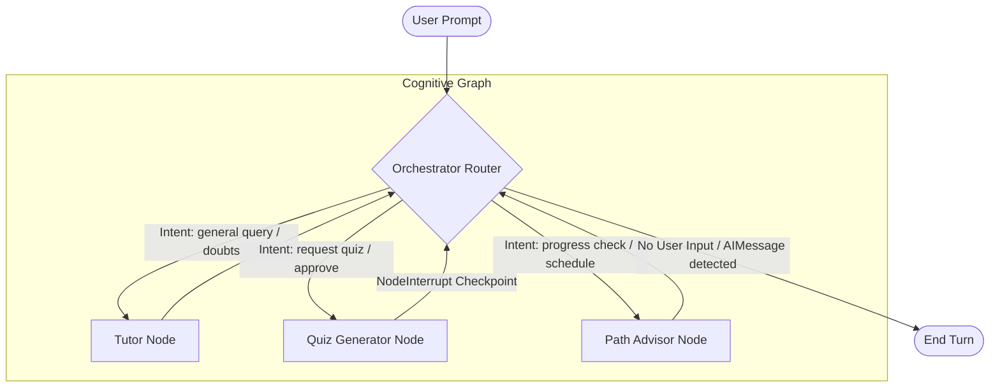

# Cognitive Multi-Agent System (LangGraph)

This document details the multi-agent cognitive architecture of the AI-LMS platform. The system is designed to provide stateful, interactive tutoring, quiz moderation, and personalized study advisement using a structured execution graph built on **LangGraph**.

---

## 🗺️ Agent Routing & Topology Diagram

The graph execution follows a hub-and-spoke model. The **Orchestrator Router** acts as the central hub, classifying user intent and delegating to specialized nodes. Specialized nodes perform their tasks and loop execution control back to the Orchestrator.



---

## 💾 Graph State Schema (`AgentState`)

The graph nodes share a unified execution state defined as a `TypedDict` (`agents/state.py`):

| Key | Type | Description |
| :--- | :--- | :--- |
| `messages` | `List[BaseMessage]` | The accumulated chat history between user and agents (LangChain message objects). |
| `current_agent` | `str` | Name of the active agent node (e.g. `'orchestrator'`, `'tutor'`, `'quiz_generator'`, `'path_advisor'`). |
| `user_id` | `str` | UUID representation of the student requesting help. |
| `course_id` | `str` | UUID representation of the course context. |
| `context` | `List[str]` | List of retrieved RAG document chunks injected as prompt context. |
| `quiz_data` | `Optional[Dict]` | Structured JSON object holding quiz questions, answers, and difficulty details. |
| `study_plan` | `Optional[Dict]` | Structured JSON object holding generated study schedules and progress summaries. |
| `next_action` | `str` | Control routing flag indicating destination node (`'tutor'`, `'quiz_generator'`, `'path_advisor'`, `'end'`). |
| `error` | `Optional[str]` | Logs errors and processing failures across node scopes. |

---

## 🚦 Node Execution & Transition Logic

### 1. Orchestrator Node (`orchestrator`)
The entry point of the graph. It performs two duties:
* **Turn Resolution:** If the last message is an `AIMessage`, it implies that a specialized agent has successfully responded to the user. The turn is terminated, routing execution to `END`.
* **Intent Classification:** If the last message is a `HumanMessage`, it queries `gpt-4o-mini` with a structured JSON output specification:
  ```json
  {
    "agent": "tutor" | "quiz_generator" | "path_advisor",
    "reason": "String justification"
  }
  ```
* **Offline Fallback Heuristic:** If `OPENAI_API_KEY` is not set or set to `mock-key-for-testing`, the orchestrator defaults to keyword matching (e.g. searching for "quiz", "test", "progress", "schedule", "hours") to choose the target node.

### 2. Tutor Node (`tutor`)
* **Purpose:** Explains academic concepts and answers specific student questions.
* **Retrieval Tool:** Invokes `search_course_docs` which performs dense + sparse hybrid vector search and Cohere reranking.
* **Citation Constraint:** Prompts the LLM to format answers citing sources directly from the retrieved context metadata (e.g. `[Source: decorators.pdf, Page 3]`).

### 3. Quiz Generator Node (`quiz_generator`)
* **Purpose:** Compiles practice questions to evaluate concept retention.
* **Checkpoint Interruption:** After generating a quiz, it populates `state["quiz_data"]` and raises a `NodeInterrupt`. This halts graph execution and flushes the checkpoint data to the DB persistence layer.
* **Approval Flow:**
  - When the user resumes the graph with a response like "approve", "yes", or "looks good", the node validates the response, formatting the quiz questions to send to the student.
  - If the user replies "regenerate" or "no", the node clears the old quiz and triggers a fresh generation.

### 4. Path Advisor Node (`path_advisor`)
* **Purpose:** Recommends next study steps and builds 7-day calendar tables.
* **Context Resolution:** Queries SQLAlchemy models (`LessonProgress` and `Submission`) via config dependency, extracts weak topics (scores < 60%), and fetches the next logical incomplete lesson in the syllabus hierarchy.
* **Output:** Compiles an actionable schedule which is logged to state and displayed to the student.

---

## 🤝 Human-in-the-Loop Validation (Deep Dive)

The platform integrates admin-moderated checks on sensitive AI actions (like compiling course quizzes) using LangGraph checkpointers.

### Execution Walkthrough:
1. **User Request:** A student asks: *"Can you test me on decorators?"*
2. **Orchestrator Routing:** The orchestrator router identifies the intent and directs execution to the `quiz_generator` node.
3. **Generation and Pause:** The `quiz_generator` node calls OpenAI to compile 3 questions and raises `NodeInterrupt("[SYSTEM REVIEW CHANNELS - QUIZ PENDING APPROVAL]")`.
4. **SSE Response:** The backend SSE connection sends a stream termination signal carrying `type: "interrupt"` along with `quiz_data`.
5. **Awaiting Interaction:** The execution thread is suspended. The instructor can view the generated questions on the dashboard.
6. **State Resumption:** When the instructor clicks "Approve", the client sends a message containing `"approve"` to `POST /ai/chat`.
7. **Graph Resume:** The server retrieves the graph state using `thread_id` (representing the user-course combination), applies the human decision message to history, and invokes the graph.
8. **Final Output:** The `quiz_generator` validates the approval token, formats the questions into the message stream, and returns control back to the orchestrator.
